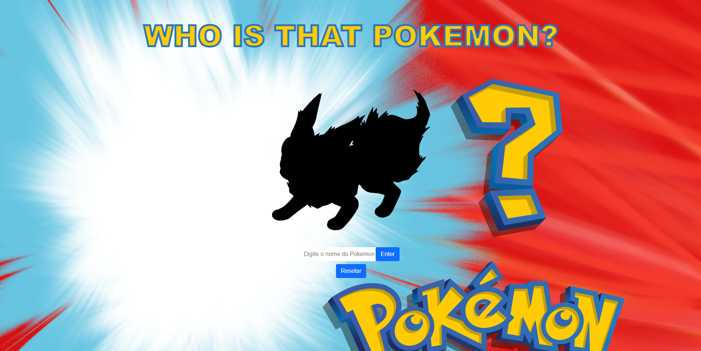
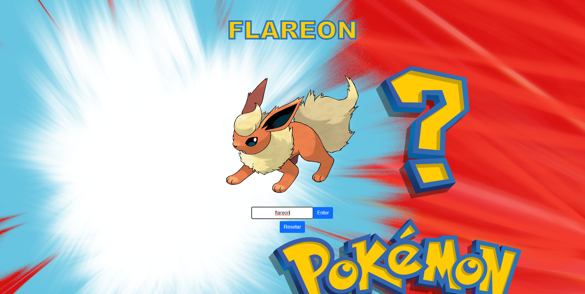

# Who is That Pokemon?

Desafio solicitado por Roberto Campos, para o grupo de mentoria TI para a Vida.

### O sistema conta com os 151 pokemons da primeira geração, através da PokéAPI

## Tecnologias utilizadas:
#### HTML, Javascript, CSS, PokéAPI e Bootstrap
